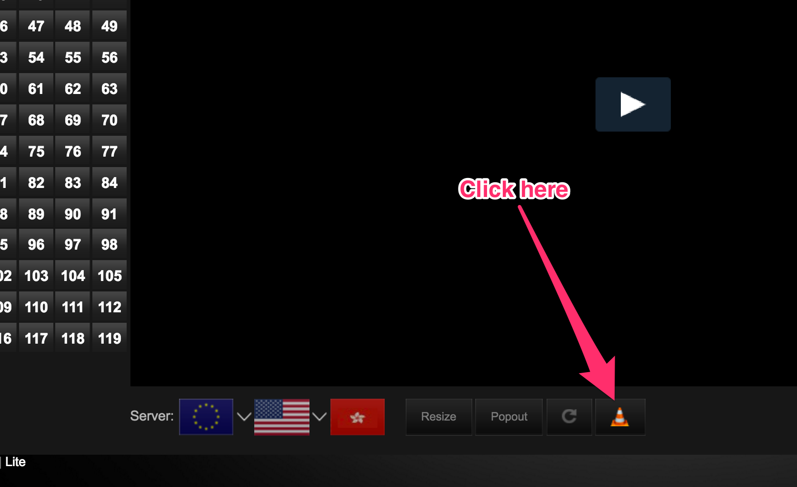
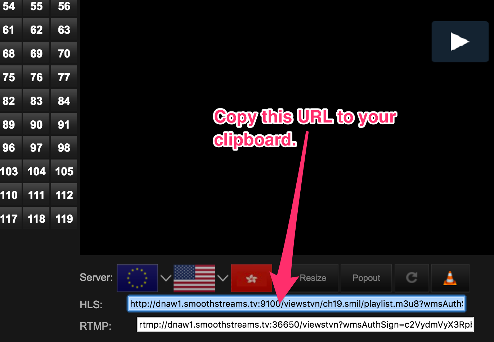
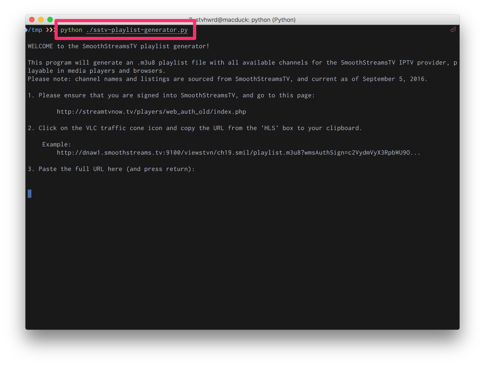
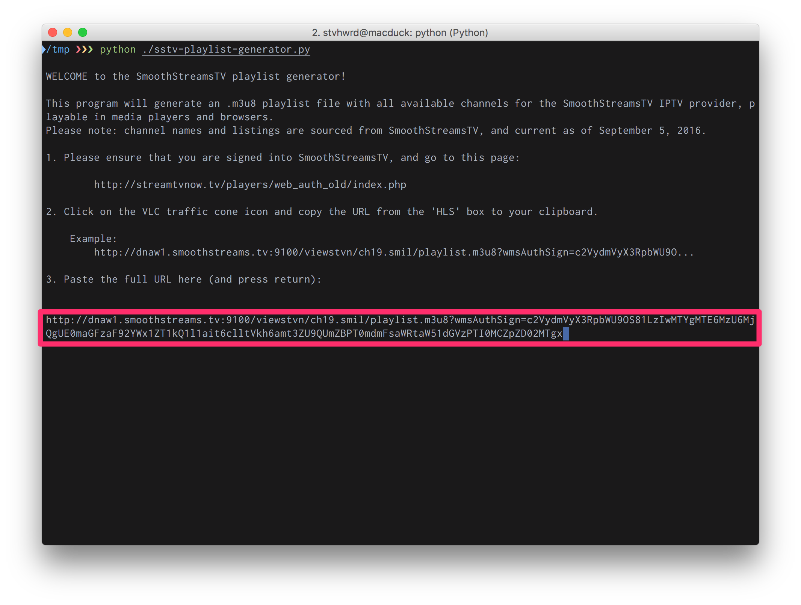
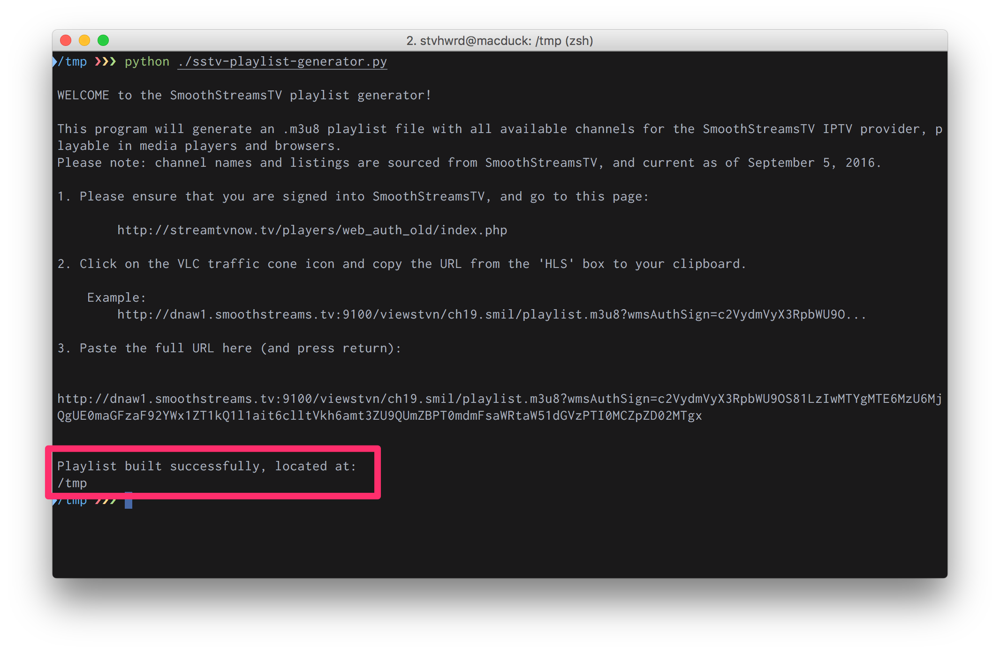
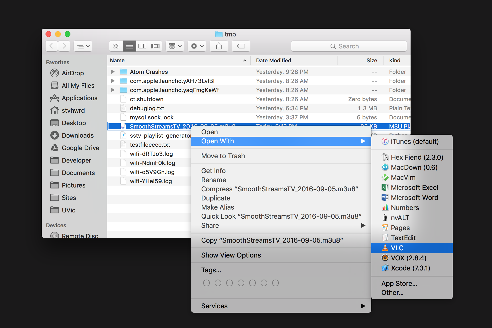
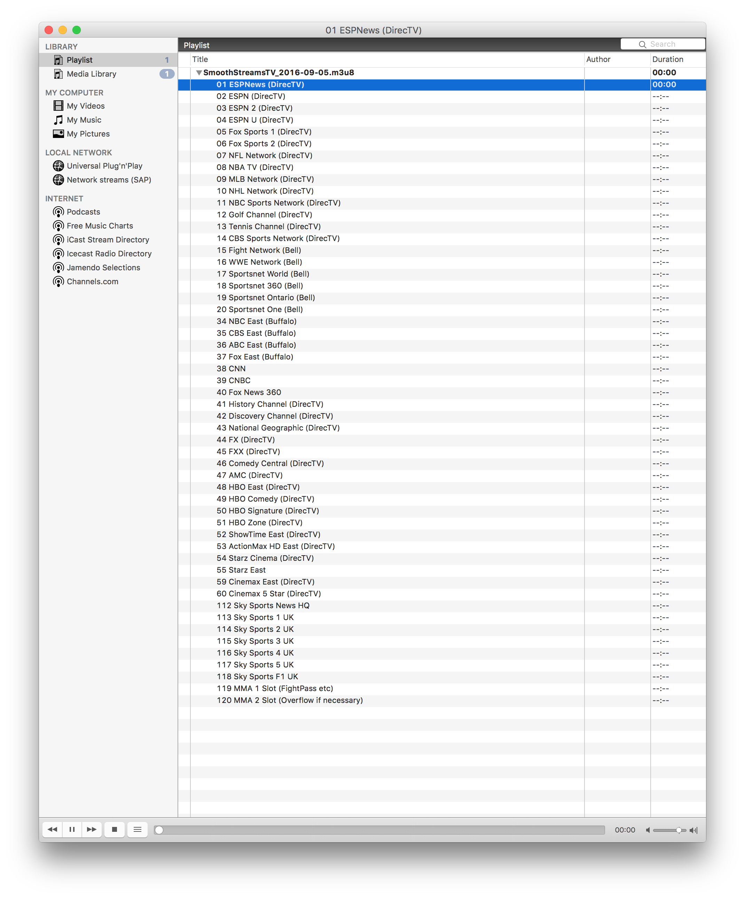
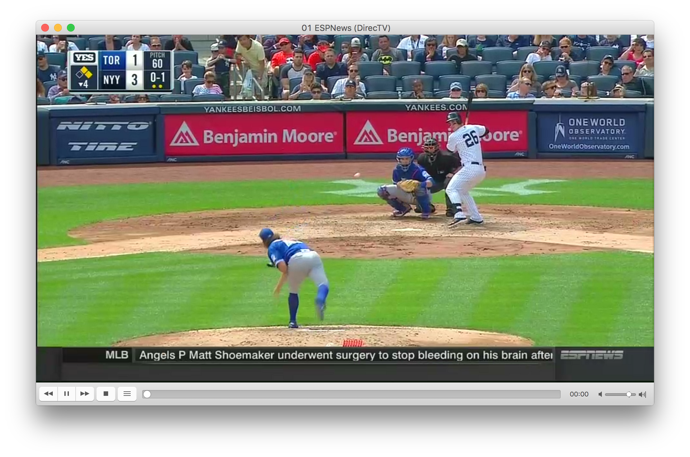

# SSTV-playlist
Generate a M3U8 playlist from an authenticated [SmoothStreamsTV URL](http://streamtvnow.tv/players/web_auth_old/index.php).  No affiliation with SmoothStreamsTV or StreamTVNow.

This program will output an M3U8 playlist file when fed an authenticated URL.  

## Note: Authentication tokens expire every 24 hours, so this will have to be run once per day to generate a valid playlist.  For those with some scripting/programming ability, this should be trivial.

It simply extracts the auth token from the authenticated URL and inserts it into an m3u8 template with the channel names/URLs from StreamTVNow.

## Why did I build this?


#### Because [VLC](https://www.videolan.org/) is my favourite media player.
...and it plays nicely with M3U8 playlists, including playlists of HLS streams.

## How do I use this?

#### 1. Sign in to your account on [StreamTVNow](http://streamtvnow.tv).

#### 2. Go to the ["old" player page](http://streamtvnow.tv/players/web_auth_old/index.php).

#### 3. Click on the VLC traffic cone icon, below the video player frame.



#### 4. Highlight and copy the link that appears beside the **HLS** box.



#### 5. Open a terminal (AKA command line) and run the python script.

```python
cd /path/to/the/script
python ./sstv-playlist-generator.py
```



#### 6. Paste the URL from your clipboard into the terminal window.



#### 7. Playlist is built and placed in the same folder as the script.



#### 8. Navigate to that folder and open the m3u8 file in VLC by drag-and-drop or right click.



You'll now see the list of channels available in VLC's playlist.



Double-click one to begin playing in VLC.



## That's all!

#### Please feel free to [open an issue](https://github.com/stvhwrd/SmoothStreamsTV-playlist/issues) or contribute some improvements!
